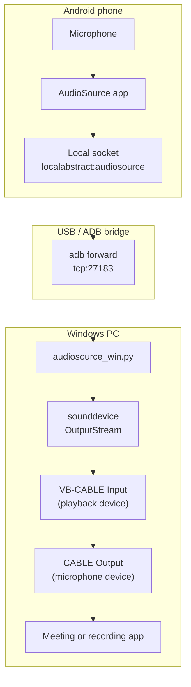

# AudioSource Win

Use an Android phone as a microphone on Windows through [AudioSource](https://github.com/gdzx/audiosource), ADB, and VB-Audio Virtual Cable.

AudioSource Win is a small Windows bridge for the Android AudioSource app. The Android side records microphone audio and exposes a local socket. This project connects to that stream through ADB and plays the PCM audio into VB-CABLE, so Windows applications can select it as a microphone.

## How It Works



Data path:

1. Android records microphone audio with the upstream AudioSource app.
2. ADB forwards the Android local socket to `127.0.0.1:27183` on Windows.
3. AudioSource Win writes the PCM stream to `VB-CABLE Input`; Windows apps select `CABLE Output` as the microphone.

Default audio format:

- 44100 Hz
- 16-bit signed PCM
- mono input from Android
- stereo output to the Windows audio device

## Relationship To gdzx/audiosource

This project is inspired by and designed to work with [gdzx/audiosource](https://github.com/gdzx/audiosource).

The upstream project targets GNU/Linux and injects the Android microphone stream into PulseAudio/PipeWire. AudioSource Win provides the Windows side of the same idea by sending the Android microphone stream to VB-Audio Virtual Cable.

## Android App

AudioSource Win does not include or modify the Android app. Install the upstream AudioSource Android app first:

- [F-Droid](https://f-droid.org/packages/fr.dzx.audiosource/)
- [GitHub Releases](https://github.com/gdzx/audiosource/releases)

This repository only contains the Windows bridge.

## Requirements

- Windows
- Python 3.10+
- Android Platform Tools with `adb` available in `PATH`
- Android device with USB debugging enabled
- Android app package `fr.dzx.audiosource` installed on the device
- [VB-Audio Virtual Cable](https://vb-audio.com/Cable/) installed on Windows

## Installation

Clone the repository and install the Python dependencies:

```powershell
pip install -r requirements.txt
```

For editable local development:

```powershell
pip install -e .
```

After editable installation, the command `audiosource-win` is available:

```powershell
audiosource-win --help
```

You can also run the script directly:

```powershell
python audiosource_win.py --help
```

## Usage

Recommended automatic mode:

```powershell
python audiosource_win.py
```

Automatic mode will:

- check that `adb` exists
- check that exactly one Android device is online
- start the Android AudioSource app
- try to grant microphone and notification permissions
- create the ADB forward
- stream audio to VB-CABLE

If multiple Android devices are connected:

```powershell
adb devices
python audiosource_win.py --serial <device-serial>
```

List Windows audio devices:

```powershell
python audiosource_win.py --list-devices
```

Specify an output device manually:

```powershell
python audiosource_win.py --device 26
```

Use an existing ADB forward instead of automatic setup:

```powershell
adb forward tcp:27183 localabstract:audiosource
python audiosource_win.py --no-auto-adb
```

Adjust software gain:

```powershell
python audiosource_win.py --gain 1.5
```

Enable verbose logs:

```powershell
python audiosource_win.py --verbose
```

## Troubleshooting

### adb is not found

Install Android Platform Tools and make sure the directory containing `adb.exe` is in `PATH`.

### Multiple Android devices are connected

Use `--serial` to select the intended device. The program does not silently pick the first device because that can route audio from the wrong phone.

### VB-CABLE is not detected

Run:

```powershell
python audiosource_win.py --list-devices
```

Find the `CABLE Input` or `VB-Audio` output device and pass its index with `--device`.

### Windows applications do not receive audio

Check these points:

- the Android app is installed and has microphone permission
- `adb devices` shows the device as `device`
- this program is outputting to `CABLE Input`
- the target Windows application selects `CABLE Output` as microphone
- no other application has exclusive control of the VB-CABLE device

### Audio drops or stutters

Try:

```powershell
python audiosource_win.py --queue-blocks 128
```

You can also try a different VB-CABLE device index from `--list-devices`.

## Development

Run a syntax check:

```powershell
python -m py_compile audiosource_win.py
```

Run the command help:

```powershell
python audiosource_win.py --help
```

The project is intentionally small. The current implementation is a single Python module so it can be copied, audited, and run easily.

## License

MIT. See [LICENSE](LICENSE).
