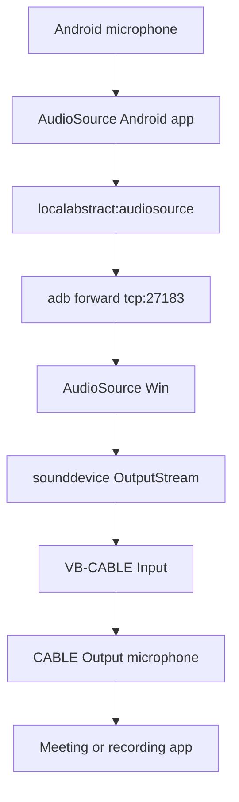

# AudioSource Win

Use an Android phone as a microphone on Windows through [AudioSource](https://github.com/gdzx/audiosource), ADB, and VB-Audio Virtual Cable.

AudioSource Win is a small Windows bridge for the Android AudioSource app. The Android side records microphone audio and exposes `localabstract:audiosource`. This project connects to that stream through ADB and plays the PCM audio into VB-CABLE, so Windows applications can select `CABLE Output` as a microphone.

## How It Works



Default audio format:

- 44100 Hz
- 16-bit signed PCM
- mono input from Android
- stereo output to the Windows audio device

This repository only contains the Windows bridge. It does not include ASR, hotkeys, text insertion, VoiceBridge integration, or Android app development.

## Requirements

- Windows
- Python 3.10+
- Android Platform Tools with `adb` available in `PATH`
- Android device with USB debugging or wireless debugging enabled
- Android app package `fr.dzx.audiosource` installed on the device
- [VB-Audio Virtual Cable](https://vb-audio.com/Cable/) installed on Windows

Install dependencies:

```powershell
pip install -r requirements.txt
```

For editable development:

```powershell
pip install -e ".[dev]"
```

## Command Overview

```powershell
python audiosource_win.py --help
python audiosource_win.py run --help
python audiosource_win.py run
python audiosource_win.py devices
python audiosource_win.py list-audio
python audiosource_win.py check
python audiosource_win.py doctor
```

After editable installation, the console script is also available:

```powershell
audiosource-win check
```

Older command forms still work:

```powershell
python audiosource_win.py
python audiosource_win.py --serial <device-serial>
python audiosource_win.py --device <index>
python audiosource_win.py --list-devices
python audiosource_win.py --no-auto-adb
python audiosource_win.py --gain 1.5
python audiosource_win.py --verbose
```

## Run

Recommended automatic mode:

```powershell
python audiosource_win.py run
```

Automatic mode will:

- check that `adb` exists
- require exactly one online Android device, unless `--serial` is passed
- start the Android AudioSource app
- try to grant microphone and notification permissions
- recreate `adb forward tcp:27183 localabstract:audiosource`
- stream audio to VB-CABLE or the selected output device
- print one-line runtime status updates
- reconnect automatically after socket, ADB, or stream interruptions

Useful run options:

```powershell
python audiosource_win.py run --serial <device-serial>
python audiosource_win.py run --device <audio-device-index>
python audiosource_win.py run --no-auto-adb
python audiosource_win.py run --gain 1.5
python audiosource_win.py run --queue-blocks 128
python audiosource_win.py run --no-reconnect
python audiosource_win.py run --log-level DEBUG
python audiosource_win.py run --input-file test.raw
```

`--max-retries 0` means retry forever. `--silent-timeout` controls how long the bridge can go without receiving audio before forcing a reconnect.

## Runtime Status

`run` prints status lines like:

```text
STREAMING | wifi 192.168.5.19:5555 | CABLE Input | 44.1kHz 1ch->2ch | rx=172KB/s | level=-18.7dBFS | peak=-6.2dBFS | queue=3/64 | drops=0 | underruns=0 | reconnects=0 | uptime=00:12:31
```

Fields include:

- `state`: bridge state such as `CHECKING`, `STREAMING`, `SILENT`, `RECONNECTING`, or `FAILED`
- `transport`: `usb`, `wifi`, or `file`
- `rx`: recent receive rate
- `level` and `peak`: int16 PCM RMS and peak level in dBFS
- `queue`: buffered audio blocks
- `drops`: queue drops when the receiver outruns playback
- `underruns`: playback callback requests with no buffered audio
- `reconnects`: reconnect attempts
- `last_audio`: age of the most recent received audio block when known

## Diagnostics

List Android devices:

```powershell
python audiosource_win.py devices
```

Device states are reported as `online`, `offline`, `unauthorized`, or `unknown`. Serials containing `:` are shown as likely `wifi`; other serials are shown as likely `usb`.

List output-capable audio devices:

```powershell
python audiosource_win.py list-audio
```

Recommended VB-CABLE devices are marked when the name contains `cable input`, `vb-audio`, `vb-cable`, or `virtual cable`.

Run quick environment checks:

```powershell
python audiosource_win.py check
```

`check` verifies Python, imports, adb availability, `adb devices`, recommended audio output, and local port availability. Missing hardware is reported as `[WARN]` or `[FAIL]` without traceback.

Run deeper bounded diagnostics:

```powershell
python audiosource_win.py doctor
```

`doctor` checks the Android package, starts the app, attempts permission grants, recreates the ADB forward, connects to the local socket with a short timeout, tries to read audio bytes, and attempts to open the output stream. It should not hang indefinitely.

## Logging

AudioSource Win logs to both console and a rotating file. The default file path is:

```text
%APPDATA%\audiosource-win\logs\audiosource-win.log
```

If `%APPDATA%` is unavailable, the fallback is:

```text
~\.audiosource-win\logs\audiosource-win.log
```

Rotating logs use 5 MB files with 5 backups. Pass `--log-file` to override the path and `--log-level DEBUG` for detailed diagnostics.

## USB And Wireless Debugging

USB debugging is usually the most stable option:

```powershell
adb devices
python audiosource_win.py run --serial <usb-serial>
```

Wireless debugging is convenient but Android may turn it off or rotate ports:

```powershell
adb pair <phone-ip>:<pair-port>
adb connect <phone-ip>:<connect-port>
python audiosource_win.py run --serial <phone-ip>:<connect-port>
```

If wireless debugging disconnects, reconnect with `adb connect` and let AudioSource Win retry, or restart `run` with the new serial.

## Troubleshooting

### adb is not found

Install Android Platform Tools and make sure the directory containing `adb.exe` is in `PATH`, then run:

```powershell
python audiosource_win.py check
```

### Device is unauthorized

Check the phone screen and tap "Allow USB debugging". Then rerun:

```powershell
python audiosource_win.py devices
```

### Device is offline

Reconnect the USB cable, or reconnect wireless debugging with `adb connect <ip>:<port>`.

### VB-CABLE is not detected

Run:

```powershell
python audiosource_win.py list-audio
```

Find the `CABLE Input` or `VB-Audio` output device and pass its index with `--device`.

### Socket cannot connect

Run:

```powershell
python audiosource_win.py doctor
```

If using manual ADB mode, recreate the forward:

```powershell
adb forward tcp:27183 localabstract:audiosource
python audiosource_win.py run --no-auto-adb
```

### No audio level or target app receives no audio

Check that the Android app has microphone permission, `run` shows `STREAMING`, the status `level` changes while speaking, output is going to `CABLE Input`, and the target app selected `CABLE Output` as microphone.

## Development

Run automated checks:

```powershell
python -m compileall .
python -m pytest -q
python audiosource_win.py --help
python audiosource_win.py run --help
python audiosource_win.py check
python audiosource_win.py devices
python audiosource_win.py list-audio
```

The pytest suite mocks ADB, socket, and sounddevice behavior. Manual hardware checks with a real Android device and VB-CABLE are useful but should not block mock-based CI.

## License

MIT. See [LICENSE](LICENSE).
